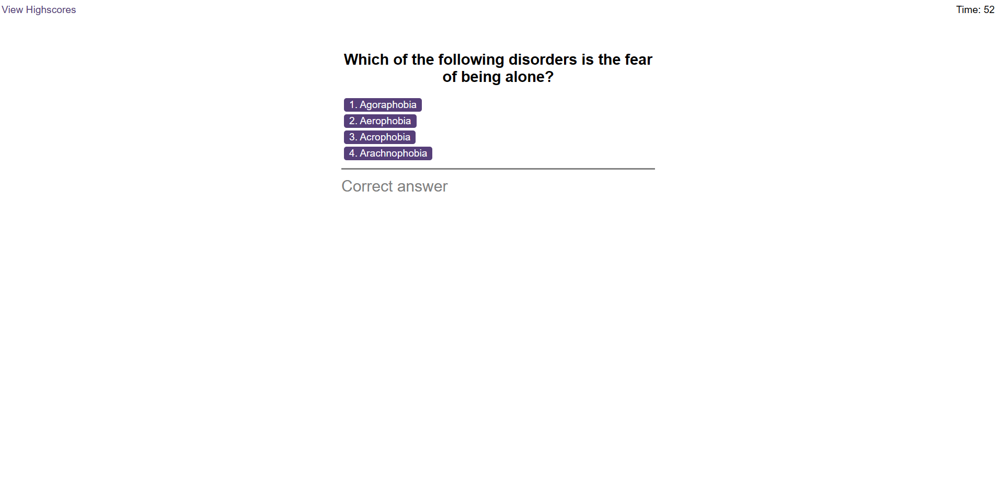

# Unit 6 Challenge: Quiz assessment

## Overview

This project is used for quiz assessment and show their scores. The scores are manipulated based on time. 

## Project Details
In this application user will be given set of questions and four options for each question. One of the options are correct. When user start the click the start quiz button the timer starts and first question will appear on the screen. If the user choose the correct answer no penalty is given. If they choose the wrong answer five seconds will be deduced. The final score is based on the amonut of time left. When time reaches zero the quiz will end. User is given an option to save their highscore and initials.

## Installation

N/A

## License

Please refer to the license in the repo

## Credits

* https://www.w3schools.com/jsref/prop_text_value.asp

* https://www.w3schools.com/jsref/met_document_addeventlistener.asp

## Deployed github link

*  https://github.com/Leonawesley/Quiz_assessment

*  https://leonawesley.github.io/Quiz_assessment/
